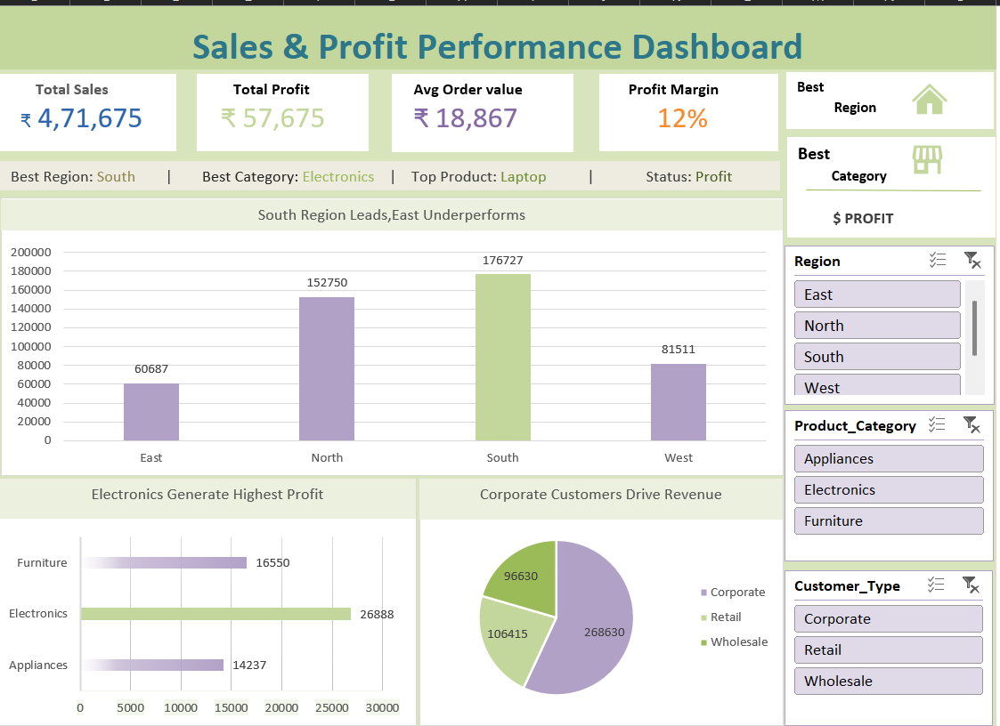

# Sales & Profit Performance Dashboard (Excel)

## Project Summary
This project is an interactive Excel dashboard designed to analyze business sales and profit performance across regions, product categories, and customer types.  
The goal is to convert raw sales data into clear business insights for decision-making.

## Business Questions Answered
- Which region generates the highest profit?
- Which product category is most profitable?
- Which customer type drives the most revenue?
- How strong is the overall profit margin?
- Which areas underperform and need attention?

## Key KPIs
- **Total Sales:** ₹4,71,675  
- **Total Profit:** ₹57,675  
- **Average Order Value:** ₹18,867  
- **Profit Margin:** 12%

## Insights
- **South region** leads in overall profit performance.  
- **East region** is the weakest performer and needs improvement strategies.  
- **Electronics** is the highest profit-generating category.  
- **Corporate customers** drive the majority of revenue.  
- Business is in **overall profit status**, not loss.

## Tools & Features Used
- Microsoft Excel  
- Pivot Tables  
- Pivot Charts  
- Slicers (Region, Category, Customer Type)  
- KPI Cards  
- Conditional Formatting  
- Dashboard Layout Design  

## Dashboard Capabilities
- Interactive filtering by:
  - Region  
  - Product Category  
  - Customer Type  
- Automated KPI calculations  
- Visual performance comparison  
- Business-ready reporting format  

## Use Case
This dashboard can be used by:
- Business managers for performance tracking  
- Sales teams for regional analysis  
- Management for strategic planning  
- Analysts for reporting and insights generation  

## Preview

